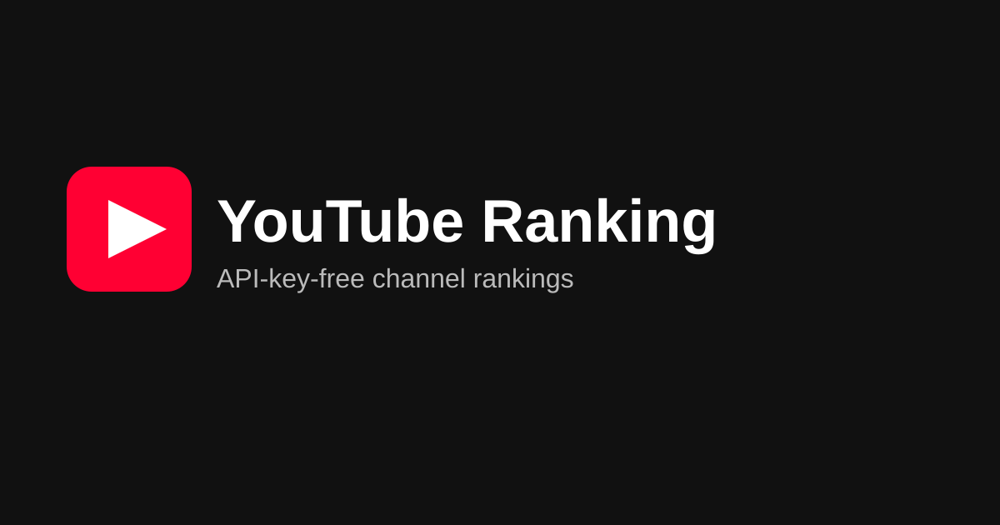

# YouTube Ranking

[](https://rsasaki0109.github.io/youtube-ranking/)
[](https://github.com/rsasaki0109/youtube-ranking/actions/workflows/update-data.yml)
[](https://github.com/rsasaki0109/youtube-ranking/actions/workflows/deploy-pages.yml)
[](LICENSE)
[](https://github.com/rsasaki0109/youtube-ranking#limitations)
[](requirements.txt)
[](package.json)

API-key-free automated YouTube channel rankings powered by yt-dlp, GitHub Actions and GitHub Pages.

> **No YouTube API key · No Google Cloud · No database · No server.**

[](https://rsasaki0109.github.io/youtube-ranking/)

👉 **[Open the live ranking site](https://rsasaki0109.github.io/youtube-ranking/)** · updated daily by GitHub Actions

Fork the repo, edit one YAML file, enable Actions + Pages — and you have a daily-updated channel ranking site.

```text
Fork
↓
Edit channels.yml
↓
Enable GitHub Actions
↓
Enable GitHub Pages
↓
Ranking site done 🎉
```

## Demo

🌐 **Live site: [https://rsasaki0109.github.io/youtube-ranking/](https://rsasaki0109.github.io/youtube-ranking/)**

After forking and setup, your own site will be live at:

```text
https://<USERNAME>.github.io/youtube-ranking/
```

## Features

- 📊 Current-value rankings: **subscribers / total views / video count**
- 📈 Growth rankings: **24h / 7d / 30d** subscriber & view growth
- 🔍 Channel search + region filter (defaults to Japan when JP channels exist) + optional category filter
- 📱 Mobile-friendly ranking table (top 3 highlighted)
- 🤖 Daily auto-update via GitHub Actions (manual run supported)
- 🌐 Fully static site on GitHub Pages (Project Pages sub-path ready)
- 🧪 pytest-covered ranking logic (no network in tests) + sample data for offline UI work

## Screenshot

> Add a screenshot after your first deploy: save it as `docs/screenshot.png` and link it here.

```text
docs/screenshot.png
```

## Architecture

```text
config/channels.yml          ← you edit this (channel URLs + optional category)
        │
        ▼  scripts/fetch_channels.py  (yt-dlp, Python API, 1 extract/channel, no downloads)
data/latest.json             ← current snapshot
data/history/YYYY-MM-DD.json ← daily snapshots (same-day file is overwritten, never duplicated)
        │
        ▼  scripts/build_rankings.py  (growth calc + sorting, fully offline)
data/rankings.json           ← pre-computed rankings for the frontend
        │
        ▼  React + Vite + Tailwind (reads rankings.json, no heavy client computation)
GitHub Pages                 ← static hosting
```

| Script | Role | Network |
| --- | --- | --- |
| `scripts/youtube_provider.py` | yt-dlp fetch + normalize to common model | Yes (YouTube only) |
| `scripts/fetch_channels.py` | Load YAML, fetch all, write `latest.json` + history | Yes |
| `scripts/build_rankings.py` | Growth + sorting → `rankings.json` | No |
| `scripts/validate_data.py` | Schema validation of generated JSON | No |
| `scripts/format_utils.py` | Compact number formatting (mirrored in TS) | No |

## Quick Start

1. **Fork** this repository.
2. Edit `config/channels.yml`:

```yaml
channels:
  - url: https://www.youtube.com/@example
    country: JP        # optional ISO code; drives the UI region filter
    category: entertainment   # optional
  - url: https://www.youtube.com/channel/UCxxxxxxxx
```

3. Go to **Actions** tab → enable workflows → run **“Update data”** once via `workflow_dispatch` (or wait for the daily schedule).
   Until the first run, the site shows the committed sample data in `data/` so the UI works immediately.
4. Go to **Settings → Pages** → Source: **GitHub Actions**.
5. Open `https://<USERNAME>.github.io/youtube-ranking/` 🎉

No secrets, no `YOUTUBE_API_KEY`, no Google Cloud project — nothing to configure.

## channels.yml

- Location: `config/channels.yml`
- `url` (required): channel URL. A handle URL (`https://www.youtube.com/@example`) is enough — channel IDs are **not** required.
- `country` (optional): ISO country code (e.g. `JP`, `US`). Used for the frontend region filter, which defaults to Japan when JP channels exist.
- `category` (optional): free-form string used for the frontend filter (e.g. `gaming`, `tech`).
- Duplicate URLs are fetched only once.

## Local Development

Requirements: Python 3.12+, Node 22+.

```bash
# backend
pip install -r requirements.txt
python -m pytest -q

# fetch live data (optional, hits YouTube)
python scripts/fetch_channels.py
python scripts/build_rankings.py
python scripts/validate_data.py

# frontend (uses data/sample/ automatically when generated data is absent)
npm ci
npm run dev      # local dev
npm run lint     # eslint
npm run build    # typecheck + production build
npm run preview  # preview the production build
```

Offline UI check: `npm run dev` copies `data/rankings.json` (or `data/sample/rankings.json` on a fresh clone) into `public/data/`, so the UI works with **no API and no network**.

## Data Format

Channel record (`data/latest.json`):

```json
{
  "channelId": "UCxxxxxxxx",
  "name": "Example Channel",
  "handle": "@example",
  "url": "https://www.youtube.com/@example",
  "thumbnail": "https://...",
  "subscriberCount": 1230000,
  "viewCount": 987654321,
  "videoCount": 543,
  "description": "...",
  "category": "tech",
  "updatedAt": "2026-09-03T09:00:00Z"
}
```

Fields that cannot be obtained (private subscriber counts, deleted channels, invalid URLs, missing metadata) are stored as `null` and shown as `-` in the UI. One channel failing never fails the whole run.

`data/rankings.json`:

```json
{
  "generatedAt": "2026-09-03T09:00:00Z",
  "channels": {
    "subscribers": [],
    "views": [],
    "videos": [],
    "subscriberGrowth24h": [],
    "subscriberGrowth7d": [],
    "subscriberGrowth30d": [],
    "viewGrowth24h": [],
    "viewGrowth7d": [],
    "viewGrowth30d": []
  },
  "meta": { "channelCount": 6, "historyDays": 3 }
}
```

## Ranking Metrics

- **Current value**: subscribers, total views, video count — sorted descending, `null` last.
- **Growth**: `growth = currentValue − previousValue`. Either side `null` → `null`.
- **Snapshot search**: exact-day snapshots may not exist, so the closest past snapshot within a tolerance is used (newer wins ties):

| Period | Accepted snapshot age |
| --- | --- |
| 24h | 1–3 days ago |
| 7d | 4–10 days ago |
| 30d | 25–35 days ago |

Outside the window (or with no history) growth is `null`.

- **Ties** share the same rank (competition ranking: 1, 2, 2, 4).
- **Rounding caveat**: YouTube rounds public subscriber counts, so fine-grained deltas (e.g. `+123 subscribers`) are not necessarily accurate. Treat **7d / 30d growth as the primary indicators** — the UI hints this as well.

## GitHub Actions

### `update-data.yml` — daily data update

Schedule: daily `0 9 * * *` (UTC) + `workflow_dispatch` manual trigger.

```text
checkout → setup Python → pip install → fetch (yt-dlp) → build rankings
→ validate → pytest → commit + push if changed → trigger Pages deploy
```

- `permissions: contents: write` + `actions: write` only (minimal, no secrets).
- No infinite loop: pushes made with `GITHUB_TOKEN` never trigger other workflows, so the data
  commit cannot re-trigger anything; the workflow then explicitly triggers `deploy-pages.yml`
  exactly once via `gh workflow run` when (and only when) fresh data was pushed.
- Fault tolerance: per-channel failures are warnings (`98 channels updated, 2 channels failed`); the run fails only when **all** channels fail or generated JSON is broken/invalid.
- Rate limiting: one lightweight extract per unique channel (`extract_flat` + `playlistend: 1`, no video lists, no downloads, single retry), with a configurable pause (`--interval`, default 2s) between channels.

### `deploy-pages.yml` — static deploy

On every `main` push: `npm ci` → `npm run build` → deploy via official `actions/upload-pages-artifact` + `actions/deploy-pages`. Uses the official GitHub Pages actions only.

## GitHub Pages

Project Pages URL: `https://<USERNAME>.github.io/youtube-ranking/`.

- `vite.config.ts` derives `base: "/<repo>/"` from `GITHUB_REPOSITORY` on Actions, so **forks work without config changes**; locally it serves from `/` (override with `VITE_BASE=/custom-base/` if needed).
- Hash routing (`#/`, `#/about`) is used so no server-side rewrite rules are required.
- SEO: title, description, Open Graph tags, `favicon.svg`, `robots.txt`, `sitemap.xml` (replace `USERNAME` in `sitemap.xml` with your own).

## Limitations

This project intentionally does **not** use the official YouTube API.

Benefits:

```text
No API key
No Google Cloud
No quota to worry about
Easy to fork
```

Drawbacks (please understand before use):

```text
Affected by YouTube-side spec/layout changes
yt-dlp updates may be required
Some metadata may be unobtainable (null)
Subscriber counts may be rounded
Data collection is best-effort, not guaranteed
```

### Field availability (verified against live yt-dlp output)

Reliably available: channel name, handle, channel ID, subscriber count, description, avatar.

**Total view count and video count are usually NOT exposed by the lightweight channel fetch**,
so the Views / Videos rankings legitimately show `-` until/unless yt-dlp exposes them. This is by
design: one cheap request per channel — enumerating videos just to count them would hammer YouTube
and is deliberately avoided. (Also note: yt-dlp's `playlist_count` on a channel page is the tab
count, not the video count, so this project intentionally ignores it.)

### yt-dlp version management

- `requirements.txt` pins a minimum version (`yt-dlp>=...`); Dependabot-style bumps or manual edits keep it current.
- If fetching breaks after a YouTube change, try the latest release first:

```bash
pip install -U yt-dlp
python scripts/fetch_channels.py --help
```

### Request load & cookies

- One minimal channel-info extract per URL; video lists/details/downloads are never fetched.
- No login, no cookies. **Never commit cookie files or `.env` files** (see `.gitignore`).

## Troubleshooting

| Symptom | Fix |
| --- | --- |
| `0 channels updated` / all fetches fail | YouTube may have changed markup → `pip install -U yt-dlp` and re-run; check Actions log for per-URL warnings |
| `rankings.json` shows `-` everywhere | History too short (growth needs past snapshots); current-value tabs should still work |
| Pages shows 404 at sub-path | Ensure Pages source is “GitHub Actions” and the deploy workflow ran on `main` |
| Local UI shows “Could not load ranking data” | Run `node scripts/copy-data.mjs` (or `npm run predev`) so `public/data/` exists |
| `yt-dlp` errors in CI only | Bump `yt-dlp` in `requirements.txt`, re-run `workflow_dispatch` |

## Contributing

Issues and PRs are welcome! Please:

1. Add/extend tests in `tests/` for ranking-logic changes (`python -m pytest -q` must pass).
2. Keep the frontend dependency footprint minimal.
3. Never add API keys, cookies, servers, or databases — static-only by design.
4. Run `npm run lint` and `npm run build` before submitting.

## License

[MIT License](LICENSE)
